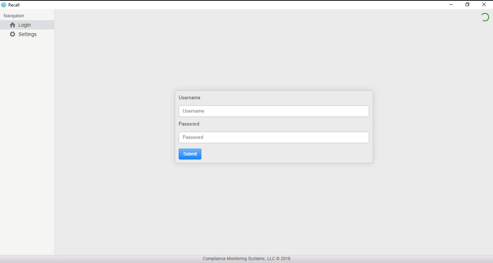
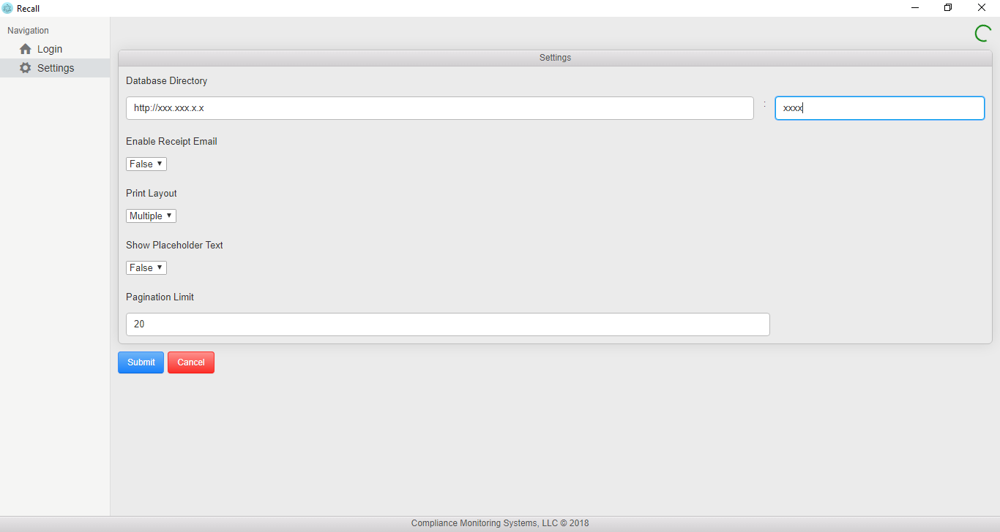
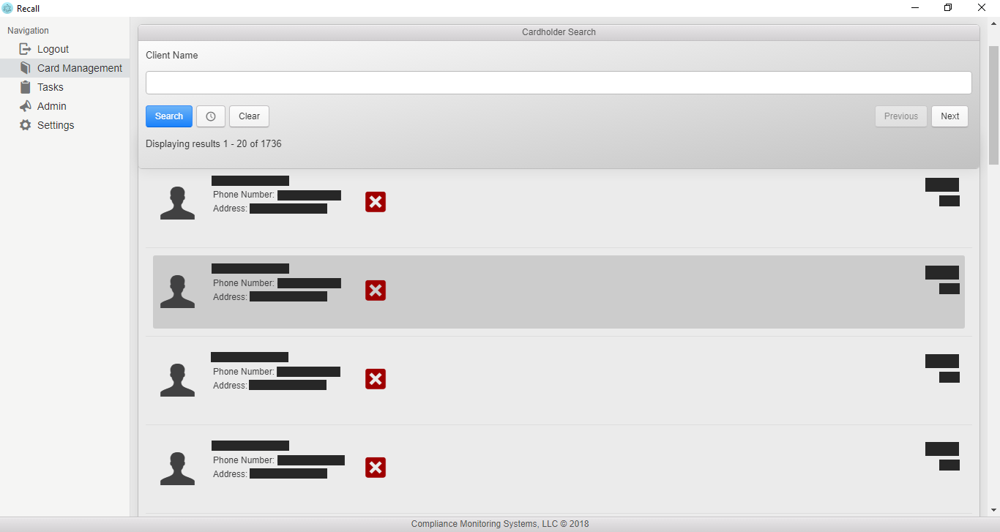
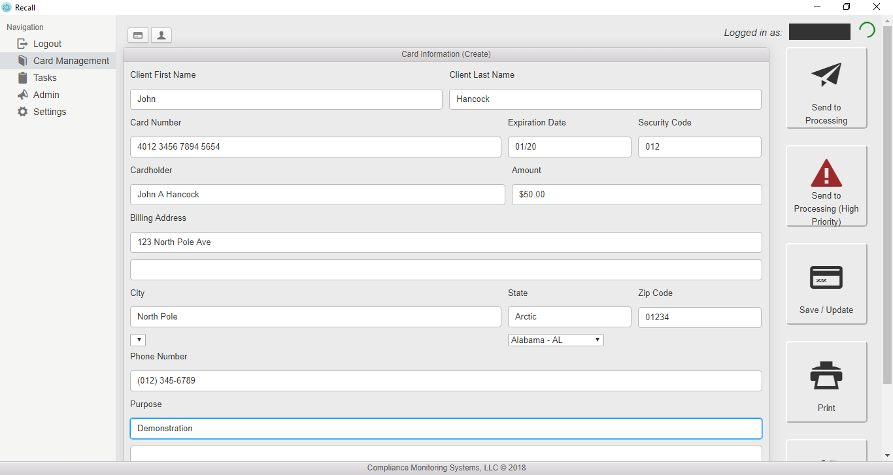

# Recall

Program used to store encrypted client financial card data on a secure server. This project is uses the Electron boilerplate 'enhanced-electron-react-boilerplate' by Phillip Barbiero found [here](https://github.com/pbarbiero/enhanced-electron-react-boilerplate).

## Client Setup
- Step 1: Download installer [here](https://github.com/CMSDev2809/recall/releases/latest) titled 'Recall-Setup-latest.exe
' where latest is the current version number.
- Step 2: Run installer.

Recall should now be installed on your system! Recall automatically checks for updates on github on every startup and will automatically download and install them.
